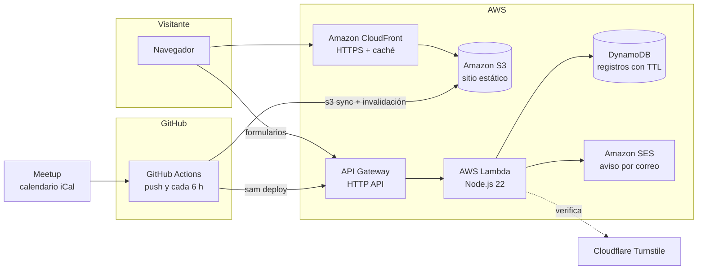

# Página web de AWS SBG UNISTMO

Sitio del **AWS Student Builder Group de la Universidad del Istmo, Campus Tehuantepec**.
Es estático y rapidísimo, se actualiza solo con los eventos de Meetup y sus formularios corren en AWS sin servidores.

> Comunidad dirigida por estudiantes. No es un sitio oficial de Amazon Web Services.

## Arquitectura



| Pieza | Herramienta |
|---|---|
| Sitio | [Astro](https://astro.build) (HTML estático) + Tailwind CSS |
| Animaciones | GSAP + ScrollTrigger, Lenis (scroll suave), CSS y canvas |
| Videos de fondo | Generados con Google Flow (Veo 3.1) a partir de la mascota del grupo: portada, llamado final y cabeceras de Aprende, Eventos y Nosotros |
| Mapa | OpenStreetMap (iframe, se carga al acercarse) |
| Hosting | Amazon S3 (privado) + Amazon CloudFront (OAC, HTTP/3, cabeceras de seguridad) |
| Formularios | API Gateway (HTTP API, con límite de peticiones) → Lambda → DynamoDB + SES |
| Anti-bots | Cloudflare Turnstile + campo trampa |
| Infraestructura como código | AWS SAM (`backend/template.yaml`) |
| CI/CD | GitHub Actions con OIDC: entra a AWS sin guardar llaves |

## Costo

Todo cabe en el nivel gratuito de AWS. Con unas 2,000 visitas al mes, el gasto es de centavos (S3) y lo cubren los créditos.
Lo único que se paga aparte es el dominio propio, si se usa (~US$10–16 al año).

## Trabajar en local

Necesitas Node.js 22 o más reciente.

```sh
npm install
npm run dev          # http://localhost:4321
npm run build        # genera dist/
```

- **Eventos:** `node scripts/fetch-meetup-events.mjs` descarga el calendario del Meetup a `src/data/events.json`.
  Si Meetup no responde, conserva los eventos anteriores.
- **Formularios en local:** sin `PUBLIC_API_URL`, los formularios abren el correo con los datos ya escritos.
  Para probarlos contra la API real, copia `.env.example` a `.env` y pon la URL de la API.

## Cambiar contenido

| Qué | Dónde |
|---|---|
| Textos generales, redes, navegación, actividades | `src/data/site.ts` |
| Equipo, eventos propios y alianzas (con el CMS activado) | Panel de Strapi (`cms/`) |
| Equipo (nombre, rol, carrera, LinkedIn y foto opcional en `public/img/equipo/`) | `equipo` en `src/data/site.ts` |
| Alianzas (con la lista vacía se muestra cómo ser aliado) | `alianzas` en `src/data/site.ts` |
| Barra de aviso de arriba (texto vacío = no se muestra) | `anuncio` en `src/data/site.ts` |
| Servicios por categoría, beneficios, recursos, certificaciones, glosario y región de México | `src/data/contenido.ts` |
| Universidad: datos, campus, mapa y fotos (con su crédito y licencia) | `universidad` en `src/data/contenido.ts` |
| Preguntas frecuentes | `src/pages/index.astro` y `src/pages/eventos/index.astro` |
| Ruta de aprendizaje (niveles, poses, servicios y referencias) | `niveles` en `src/data/contenido.ts` |
| Mascota en toda la página (sí / no) | `usarMascota` en `src/data/site.ts` |
| Videos y fotos | `public/video`, `public/img`. Los originales de Flow están en `media-fuente/` |

La mascota lleva el logo de AWS en la playera: se usa mientras el Account Manager lo apruebe.
Con `usarMascota: false` la página queda solo con los recursos del programa.

## Publicar en AWS (una sola vez)

1. **Rol para GitHub.** En la consola de AWS, entra a CloudFormation → *Crear pila* → sube `infra/github-oidc.yaml`.
   Al terminar, copia la salida **RoleArn**.
2. **Variables del repositorio.** En GitHub, entra a *Settings → Secrets and variables → Actions*:
   - Variable `AWS_ROLE_ARN`: el RoleArn del paso 1.
   - Variable `AWS_REGION` (opcional): por defecto `us-east-1`.
   - Variable `PUBLIC_TURNSTILE_SITE_KEY` y secreto `TURNSTILE_SECRET_KEY`: las llaves de un widget de
     [Cloudflare Turnstile](https://dash.cloudflare.com/?to=/:account/turnstile) (gratis). Sin ellas se usan las de prueba.
3. **Desplegar.** Haz push a `main` o córrelo a mano en *Actions → Desplegar página*.
   El flujo crea el stack `aws-sbg-web`, compila con la URL real de la API y sube el sitio.
4. **Confirma el correo de SES.** Llega un correo de verificación a `aws.unistmo@gmail.com`; abre el enlace.
   Mientras la cuenta esté en el *sandbox* de SES, los avisos solo llegan a correos verificados, y con este basta.

La dirección pública aparece en la salida **SiteUrl** del stack y en el entorno *produccion* del repositorio.

### Dominio propio (opcional)

1. Pide un certificado en **ACM, región us-east-1**, para tu dominio, y valídalo por DNS.
2. Agrega las variables `DOMAIN_NAME` (por ejemplo `www.ejemplo.org`) y `CERTIFICATE_ARN`, y vuelve a desplegar.
3. En tu DNS, crea un CNAME de ese nombre hacia el dominio de CloudFront.

> Las *AWS Trademark Guidelines* no permiten registrar dominios que contengan "AWS" sin permiso escrito.
> Consulta con el Account Manager antes de comprar uno.

## CMS (Strapi): editar equipo, eventos y alianzas

En `cms/` hay un Strapi para editar sin código las tarjetas del equipo, los eventos y las alianzas.
Cada integrante entra con su propia cuenta (rol **Author**) y solo puede editar y publicar su tarjeta.
Al publicar, Strapi lanza este flujo y la página se actualiza sola en 2–3 minutos.
Mientras el CMS no esté activado, la página usa los datos de `src/data/site.ts`.
Detalles y trabajo en local: [cms/README.md](cms/README.md).

### Activarlo en AWS (una sola vez, después de «Publicar en AWS»)

1. **Permisos.** En CloudFormation, actualiza el stack del rol de GitHub con la versión nueva de `infra/github-oidc.yaml`.
   Ahora puede crear la instancia, la imagen y la distribución del CMS.
2. **Encenderlo.** Agrega la variable de repositorio `CMS_ACTIVO` = `true` y corre el flujo «Desplegar página».
   Se crea el stack `aws-sbg-web-cms` y, en el resumen del flujo, aparece la dirección del panel (`…cloudfront.net/admin`).
3. **Tu cuenta.** Abre esa dirección **de inmediato** y crea la cuenta de Super Admin: la primera persona que entra la crea.
4. **Conectar la página.** En el panel, ve a Ajustes → Tokens de API → `web` → Ver token.
   - Cópialo al secreto `STRAPI_TOKEN`.
   - Pon la dirección del CMS, sin `/admin`, en la variable `STRAPI_URL`.
5. **Actualización inmediata (opcional).**
   - Crea en GitHub un token *fine-grained* solo del repo `web` con permiso **Actions: Read and write**.
   - Guárdalo en Systems Manager → Parameter Store como `SecureString` con el nombre `/aws-sbg-web/cms/github-token`.
   - Vuelve a correr el flujo.
   - Sin este token, los cambios del CMS se ven en la compilación programada (cada 6 h).
6. **Tu equipo.** Ajustes → Usuarios → Invitar con rol Author, y pon el mismo correo en «Correo del editor» de su tarjeta.

Costo aproximado: ~US$11 al mes (EC2 t4g.micro, IP pública y disco). CloudFront entra en la capa gratuita.

## Vista previa

Mientras AWS no esté configurado, cada push publica una vista previa en GitHub Pages, sin formularios conectados:
<https://aws-sbg-unistmo.github.io/web/>

## Estructura

```
src/
  components/   Encabezado, portada con video, ruta, diagrama, formularios…
  data/         site.ts y contenido.ts (textos), events.json (generado desde Meetup)
  layouts/      Plantilla base (SEO, fuentes, barra de progreso)
  pages/        inicio, aprende, eventos, nosotros, contacto, privacidad, 404
  scripts/      animaciones.ts, red.ts (partículas), formulario.ts
backend/        Plantilla SAM y código de la Lambda de formularios
cms/            Strapi: equipo, eventos y alianzas editables
infra/          Rol OIDC para GitHub Actions y la instancia del CMS
scripts/        Lectura de Meetup y ajuste de rutas para GitHub Pages
media-fuente/   Videos originales generados en Google Flow
```

## Accesibilidad y rendimiento

- Con *reducir movimiento* activado en el sistema, la página se muestra sin animaciones.
- Los videos no tienen audio y el segundo solo se descarga cuando está por aparecer en pantalla.
- Las fuentes se sirven desde el mismo sitio y se precargan para evitar saltos de diseño.
- Lighthouse (vista previa, oct-2026): escritorio 99 / 100 / 100 / 100 y celular 89 / 100 / 100 / 100 (rendimiento / accesibilidad / buenas prácticas / SEO), con CLS 0.
